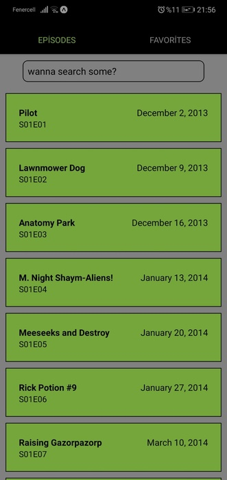
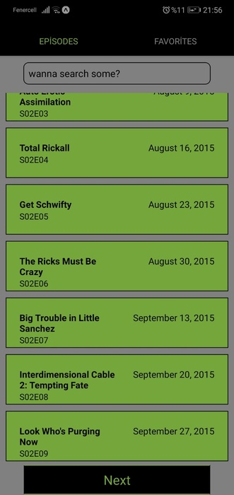
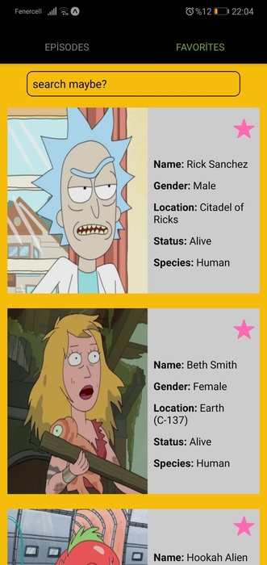
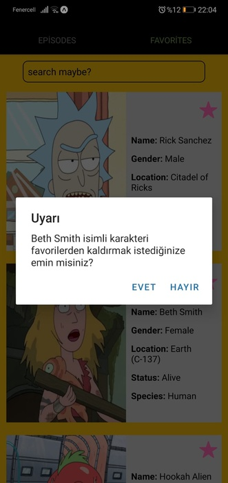

## Rick and Morty Series Study Case Project
#### This project is a study case based on the Rick and Morty series.
##### You can see examples of Async Storage and Local Notification usage in this project. Additionally, the user-friendly interface allows you to filter lists provided by the fetch process.

## Episodes Screen

## Character Screen 

## Favorites Screen

